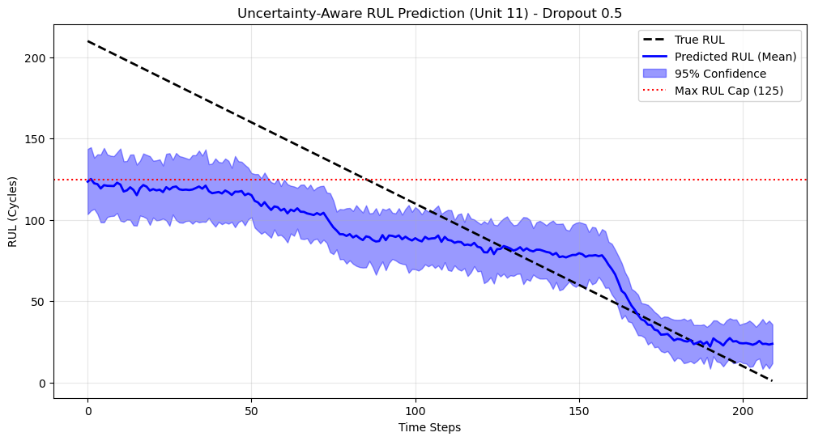
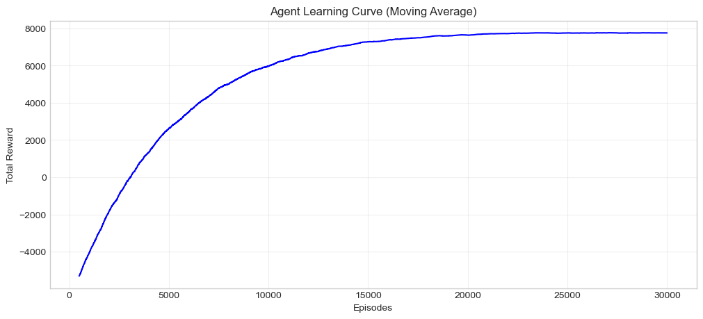

# Machine Learning for Mechanical Engineering

This repository contains homework assignments and the term project for **Machine Learning for Mechanical Engineering** at **Bilkent University**.

**Student:** Erinç Ada Ceylan  
**Department:** Mechanical Engineering  
**Email:** ada.ceylan@ug.bilkent.edu.tr  

---

##Project — Uncertainty-Aware Predictive Maintenance

**Title:** Uncertainty-Aware Reinforcement Learning for Predictive Maintenance of Turbofan Engines  

This project proposes an uncertainty-aware decision-making framework for predictive maintenance of turbofan engines by combining **Bayesian deep learning** with **reinforcement learning**.

A Long Short-Term Memory (LSTM) network with **Monte Carlo Dropout** is used to estimate both the **Remaining Useful Life (RUL)** and its **predictive uncertainty** from multivariate engine sensor data. Instead of treating RUL predictions as exact values, uncertainty is explicitly incorporated into the control loop.

The predicted mean RUL and uncertainty are transformed into a **conservative health indicator**, which is discretized into interpretable health states. A **tabular Q-learning agent** then learns an optimal maintenance policy that dynamically balances uptime rewards, maintenance costs, and catastrophic failure penalties.

The framework is validated on the **NASA C-MAPSS FD001 dataset** and compared against a fixed-threshold baseline strategy. Results show that the uncertainty-aware agent consistently avoids late interventions while remaining less conservative than static rule-based policies, leading to improved economic performance.

### Key Components
- Bayesian LSTM with Monte Carlo Dropout for probabilistic RUL estimation  
- Model-driven discrete RL state space based on uncertainty-penalized RUL  
- Tabular Q-learning for interpretable and stable policy learning  
- Economic evaluation against fixed-threshold maintenance strategies  

### Representative Results

  

  

  

  

The results demonstrate that incorporating prediction uncertainty into reinforcement learning enables **safer, more cost-effective, and interpretable maintenance decisions** for safety-critical mechanical systems.

---

## Homework 1 — Regression & Feature Engineering

Homework 1 focuses on regression methods and feature engineering using materials science datasets.  
The study starts with manual verification of basic statistics (standard deviation, RMSE, binning) and proceeds with linear regression, Ridge, LASSO, Kernel Ridge Regression, and KNN applied to a steel fatigue dataset.

Model performance is evaluated using RMSE and engineering-meaningful agreement metrics (±10%).  
Results show that polynomial features and regularization improve generalization, while KNN achieves strong local predictive accuracy.

---

## Homework 2 — Classification, Clustering & Deep Learning

Homework 2 covers supervised and unsupervised learning techniques, including KNN classification, K-means, DBSCAN, PCA, SVM, logistic regression, decision trees, random forests, gradient boosting, and Gaussian Process Regression.

The assignment also includes an image classification task on crystal structure images using transfer learning with a pre-trained Xception CNN.  
Due to the very large size of the original image dataset, only a limited subset of dominant symmetry classes was selected to keep the experiment computationally feasible.

---
