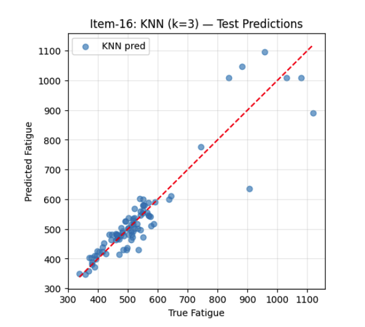
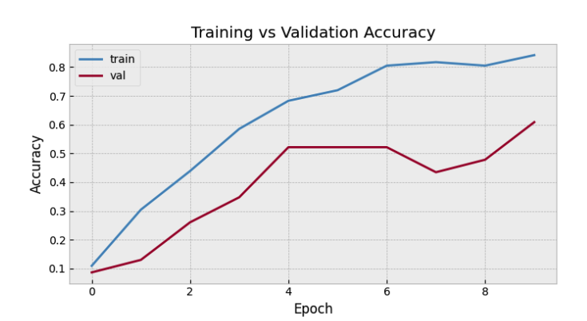
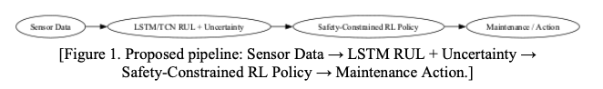

# Machine Learning for Mechanical Engineering

This repository contains homework assignments and the term project for **Machine Learning for Mechanical Engineering** at **Bilkent University**.

**Student:** Erinç Ada Ceylan  
**Department:** Mechanical Engineering  
**Email:** ada.ceylan@ug.bilkent.edu.tr  

---

## Homework 1 — Regression & Feature Engineering

Homework 1 focuses on regression methods and feature engineering using materials science datasets.  
The study starts with manual verification of basic statistics (standard deviation, RMSE, binning) and proceeds with linear regression, Ridge, LASSO, Kernel Ridge Regression, and KNN applied to a steel fatigue dataset.

Model performance is evaluated using RMSE and engineering-meaningful agreement metrics (±10%).  
Results show that polynomial features and regularization improve generalization, while KNN achieves strong local predictive accuracy.

---

## Homework 2 — Classification, Clustering & Deep Learning

Homework 2 covers supervised and unsupervised learning techniques, including KNN classification, K-means, DBSCAN, PCA, SVM, logistic regression, decision trees, random forests, gradient boosting, and Gaussian Process Regression.

The assignment also includes an image classification task on crystal structure images using transfer learning with a pre-trained Xception CNN.  
Due to the very large size of the original image dataset, only a limited subset of dominant symmetry classes was selected to keep the experiment computationally feasible.

---

## Term Project — Uncertainty-Aware Predictive Maintenance

**Title:** Uncertainty-Aware Reinforcement Learning for Predictive Maintenance of Turbofan Engines

This project develops a data-driven framework that combines Remaining Useful Life (RUL) prediction with reinforcement learning for adaptive maintenance scheduling.  
An LSTM model estimates both RUL and its uncertainty, which is then used by a risk-sensitive reinforcement learning agent to decide maintenance actions.

The approach is first validated on the NASA C-MAPSS FD001 dataset and later extended to the more realistic Aircraft Engine Run-to-Failure dataset (2021).

---
